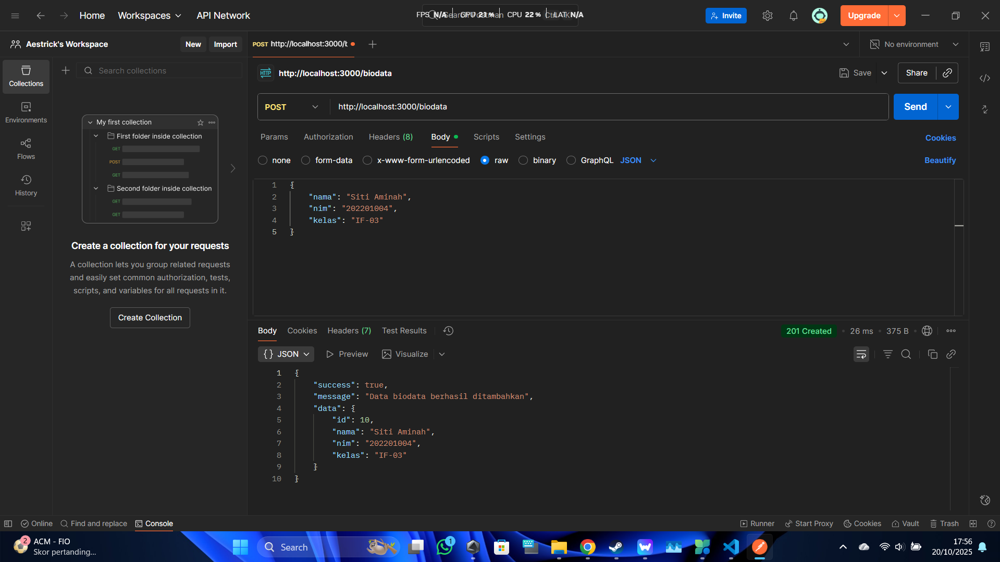
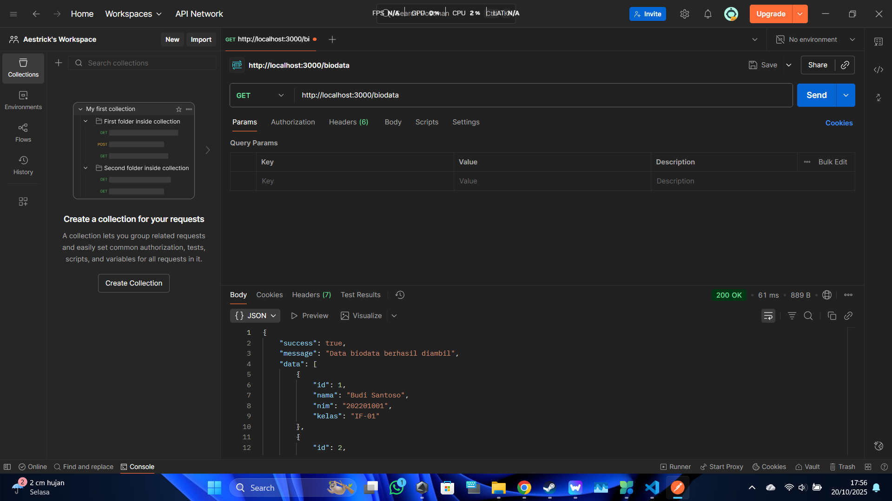
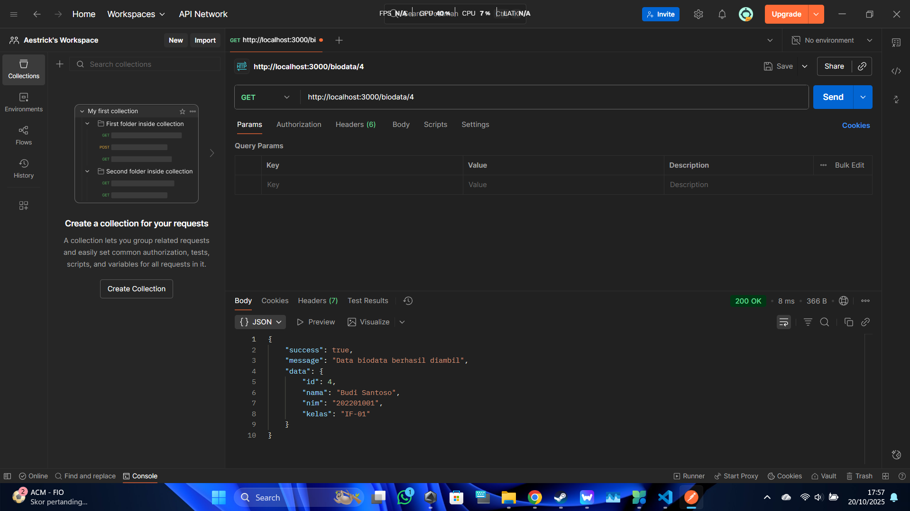
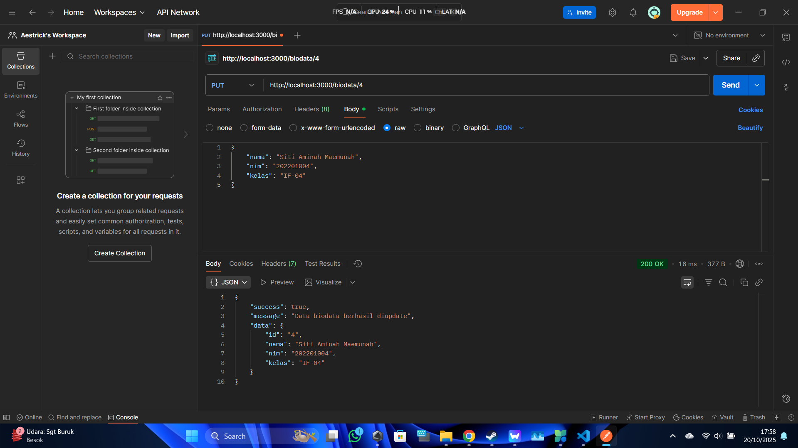
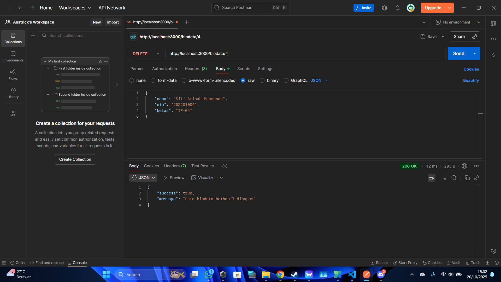

# Praktikum 3 - Operasi CRUD dengan Express.js

Proyek ini adalah implementasi web service API lengkap untuk operasi CRUD (Create, Read, Update, Delete) menggunakan Express.js dan database MySQL.

## Hasil Pengujian Postman

Berikut adalah bukti pengujian untuk setiap endpoint API.

### 1. CREATE (POST /biodata)
*Berhasil menambahkan data baru.*

### 2. READ (GET /biodata)
*Berhasil mengambil semua data.*

### 3. READ by ID (GET /biodata/:id)
*Berhasil mengambil data spesifik.*

### 4. UPDATE (PUT /biodata/:id)
*Berhasil mengubah data.*

### 5. DELETE (DELETE /biodata/:id)
*Berhasil menghapus data.*
